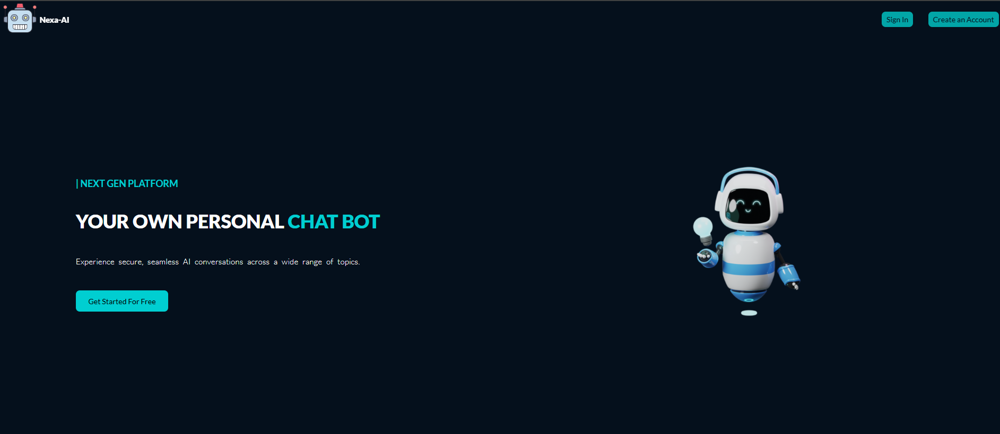
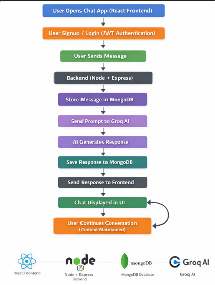
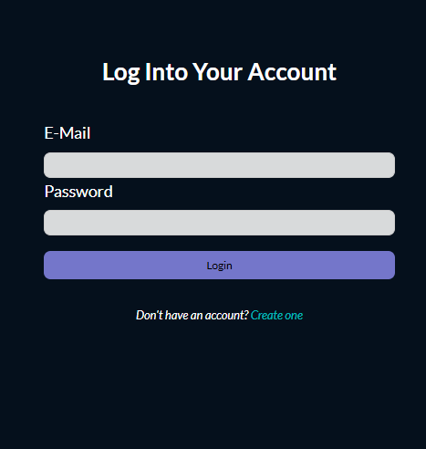
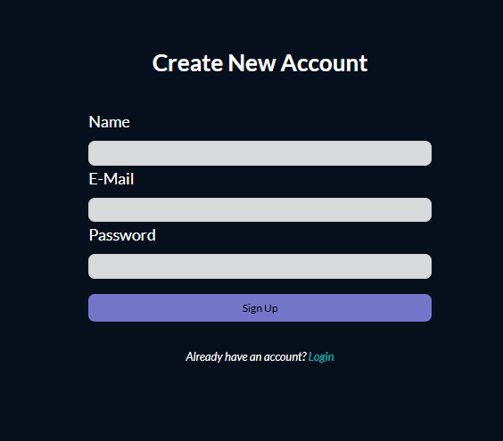
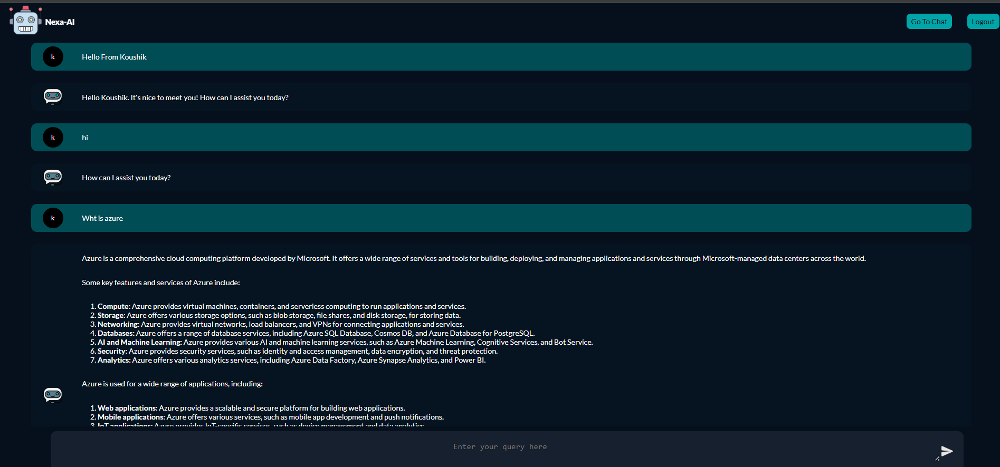
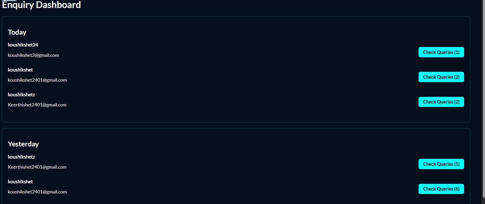

# 🤖 NexaAI — Full Stack AI Chat Platform with Admin Analytics

<p align="center">
  
</p>

NexaAI is a modern **AI-powered full-stack chat platform** built using the **MERN stack** and powered by **Groq’s ultra-fast LLM inference**.

It enables users to have intelligent, context-aware conversations while providing an **Admin Analytics Dashboard** to monitor and manage user queries.

---

## 🎯 Introduction & Objective

NexaAI demonstrates how real-world AI SaaS applications are built with:

- Secure authentication  
- Scalable backend architecture  
- Persistent conversation storage  
- Role-based access control  
- Real-time AI communication  

This is **not just a chatbot** — it is a **complete AI platform with user + admin workflow**.

---

## ✨ Features

### 👤 User Features

- 🔐 JWT Authentication with HTTP-only cookies  
- 💬 Context-aware AI conversations  
- ⚡ Ultra-fast responses using Groq  
- 🗂️ Persistent chat history (MongoDB)  
- 🎨 Clean and responsive UI  

### 🛠️ Admin Features

- 📊 Enquiry dashboard  
- 📅 Queries grouped by date (Today / Yesterday / Older)  
- 👥 User-wise query tracking  
- 🔎 Conversation monitoring  
- 🔐 Role-based protected routes  

---

## 🧭 Workflow Architecture

<p align="center">
  
</p>

### 🔄 System Flow

```

User interacts with React UI
↓
Authentication (JWT + Cookies)
↓
User sends message
↓
Express server receives request
↓
Previous chat history fetched from MongoDB
↓
Prompt sent to Groq AI model
↓
AI generates contextual response
↓
Response stored in database
↓
Admin dashboard updates enquiries
↓
Updated conversation displayed in UI

```

---

## 📸 Application Screenshots

### 🏠 Home Page

<p align="center">
  
</p>

---

### 🔐 Login Page

<p align="center">
  
</p>

---

### 📝 Signup Page

<p align="center">
  
</p>

---

### 💬 Chat Interface

<p align="center">
  
</p>

---

### 📊 Admin Enquiry Dashboard

<p align="center">
  
</p>

---

## 🧱 Tech Stack

### 🌐 Frontend
- React.js  
- Context API  
- Vite  
- Custom CSS  

### 🧠 Backend
- Node.js  
- Express.js  

### 🗄️ Database
- MongoDB  
- Mongoose  

### 🤖 AI Integration
- Groq API (LLaMA models)

### 🔐 Authentication
- JWT  
- HTTP-only Cookies  
- Cookie-parser  

---

## 📂 Project Structure

```

CHAT_APP
├── backend
│   ├── src
│   │   ├── controllers
│   │   ├── routes
│   │   ├── models
│   │   ├── utils
│   │   └── configs
│   ├── index.js
│   └── package.json
│
├── frontend
│   ├── src
│   │   ├── components
│   │   ├── pages
│   │   ├── context
│   │   └── App.jsx
│   └── package.json
│
└── img
├── Nexa-chat.png
├── Nexa-home.png
├── nexa-login.png
├── Nexa-signup.png
├── Nexa-WorkFlow.png
└── Admin-Panel.png

````

---

## ⚙️ Installation & Setup

### 1️⃣ Clone the Repository

```bash
git clone https://github.com/koushikshet2401/AI-BOT.git
cd CHAT_APP
````

---

### 2️⃣ Backend Setup

```bash
cd backend
npm install
```

Create a `.env` file:

```
PORT=5000
MONGO_URL=your_mongodb_connection_string
JWT_SECRET=your_jwt_secret
COOKIE_SECRET=your_cookie_secret
GROQ_API_KEY=your_groq_api_key
```

Start backend:

```bash
npm start
```

---

### 3️⃣ Frontend Setup

```bash
cd frontend
npm install
npm run dev
```

Open in browser:

```
http://localhost:5173
```

---

## 🔐 Role-Based Access

| Role  | Permissions       |
| ----- | ----------------- |
| User  | AI Chat           |
| Admin | Enquiry Dashboard |

---

## 🚀 Future Improvements

* 💬 Multiple chat sessions
* ⚡ Streaming AI responses (typing effect)
* 🎙️ Voice-to-text input
* 🖼️ Multimodal AI support
* 📤 Export chat as PDF
* ☁️ Cloud deployment (AWS / Vercel)
* 📈 Advanced admin analytics

---

## 🧠 What I Learned

* Building scalable MERN architecture
* Secure authentication with JWT & cookies
* Role-based authorization
* AI API integration in production-style apps
* Structured backend using controllers & services
* Global state management using Context API
* Async data flow & error handling

---

## 👨‍💻 Author

**Koushik Shet**

If you like this project, give it a ⭐ on GitHub!


